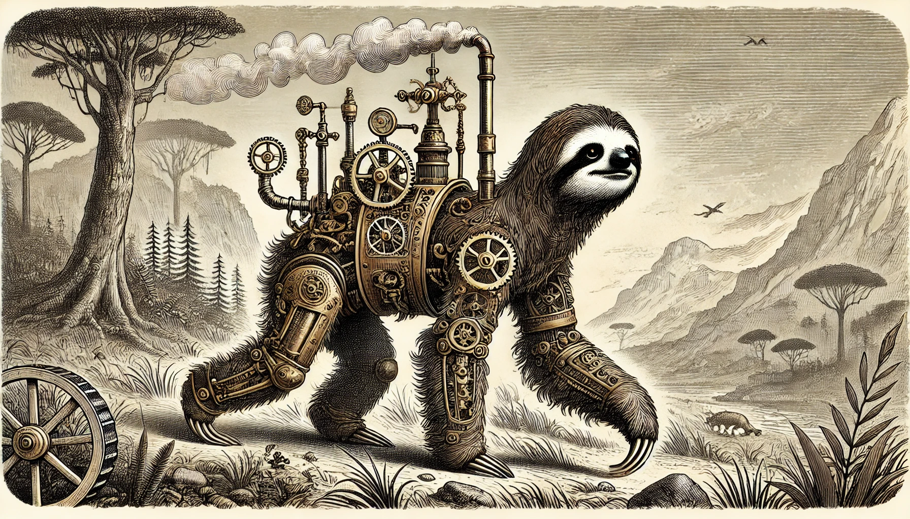

Recently, Deepseek's release under an MIT license sparked a global conversation: Is it truly open source, or just another example of "open-washing"? The practice of marketing a product as open when crucial parts remain closed is unfortunately common, fueling skepticism among developers. Take OpenAI, which, despite its name, is not fully "open," or Meta's LLaMA, whose license prohibits commercial use—prompting many to question its true openness.

These examples highlight a bigger question: **What qualifies as open source in the AI era?** The newly proposed OSI AI definition sets a checklist: release model weights, training source code, and training parameters. Yet it stops short of mandating publication of training data, citing privacy and security concerns—a stance reflecting the OSI's trademark pragmatism. Still, is that enough? Are we content with partial transparency?

Reflecting on these issues, I'm reminded of my first Machine Learning course in 2013, taught by Andrew Ng, on Coursera. Like other statistical fields—economics, psychology, engineering—machine learning models describe data and make predictions. The key difference is that machine learning **creates programs automatically**, rather than having every line of code written by hand.

Fast-forward a decade: AI is no longer about classifying apples vs. oranges; it's practically universal in scope. Tools like GPT can generate entire programs from natural-language prompts, a style that some, like Andrej Karpathy, refer to as vibe coding. [^vibe] We're inching closer to a future where people casually accept an AI's suggestions and move on.

This evolution raises a crucial point: When a model's "logic" resides in opaque weights rather than human-readable text, do the 1980s principles of free software and open source still apply? Or do we need a new model of "freedom" for AI?

As with "The twenty-six words that changed the internet" (referring to Section 230), these modern technologies remain bound by older legal and philosophical frameworks. In this post, I'll trace the origins of free software and open source—movements born in the 1980s, when personal computing was the norm—and explore the key use cases that shaped them. I'll also discuss their more recent takes on AI and how they've responded (or not) to shifts like the Internet, SaaS, hardware developments, and cryptography. Some of those topics will be reserved for future research, but my aim here is to see whether the old ideals can—or should—evolve to meet the challenges of 21st-century AI.

## The Response from the Free Software Camp

### Complaint About the Unix System

The story begins with the Unix system, first developed in 1969 by Bell Labs, a research arm of AT&T. Due to antitrust constraints, AT&T was barred from the computer business and thus licensed Unix to academic and research institutions. This policy fostered a culture of sharing Unix source code among universities, which helped it gain widespread popularity.

However, by 1984, AT&T had divested Bell Labs and was free to commercialize its software. Unix became a for-profit product, and users were no longer permitted to modify its code. In response, Richard Stallman launched the GNU project in 1983 to rebuild a free software stack. That stack included essential tools like GNU Emacs (an editor), the GNU Debugger, and the GNU C Compiler.

By 1986, an initial version of “software freedom” principles was published. [^freedom] The modern formulation adds Freedom 0—a more fundamental liberty—and reads as follows: [^modern_freedom]

> - The freedom to run the program as you wish, for any purpose (freedom 0).
> - The freedom to study how the program works, and change it so it does your computing as you wish (freedom 1). Access to the source code is a precondition for this.
> - The freedom to redistribute copies so you can help others (freedom 2).
> - The freedom to distribute copies of your modified versions to others (freedom 3). By doing this you can give the whole community a chance to benefit from your changes. Access to the source code is a precondition for this.

In essence, these four freedoms guarantee the ability to run, study, modify, and share software.

### Rationales Behind the Freedoms

AT&T's shift to a proprietary model for Unix illustrated how a company could wield tremendous power over users and developers. [^life_and_death] Stallman and others believed such control harmed both collaboration and user autonomy. Looking deeper, several motivations appear: [^means_ends]

#### Solidarity of Users

The GNU Manifesto [^manifesto] frames software sharing as a moral duty:

> I consider that the Golden Rule requires that if I like a program I must share it with other people who like it. Software sellers want to divide the users and conquer them, making each user agree not to share with others. I refuse to break solidarity with other users in this way...

The Free Software Foundation's 20-year review echoes that sentiment:

> Nonfree software ... prohibits cooperation and community. You are typically unable to see the source code... If you don't like it, you are helpless to change it. Worst of all, you are forbidden to share it with anyone else.
[^fsf_20yrs]

#### Security and Transparency

This same text highlights security concerns: without open access to source code, users can't detect or fix malicious tricks or bugs. A strong presumption arose that open, inspectable code is inherently safer.

Interestingly, communities within the Ethereum and broader blockchain space often label open protocols or code as public goods. They employ the formal economic terminology of "non-rival" and "non-excludable" to argue that permissionless networks benefit everyone without diminishing value for any single user. In contrast, the FSF rarely frames software in these precise terms, focusing instead on moral and practical freedoms (run, study, modify, share). While the FSF's stance naturally aligns with a "public good" viewpoint—since copying software doesn't diminish its utility—Richard Stallman's writings generally avoid the language of economics and emphasize user solidarity and autonomy instead.

### What is the Free Software Movement About?

In principle, software then (and now) still involves human-readable source code compiled into machine code. To exercise these freedoms, a community also needs a free compiler and operating system—hence Stallman's push for a GNU operating system to replace proprietary Unix. While Linux, created by Linus Torvalds in the early 1990s, eventually completed that vision, the drive began with Stallman's stand against proprietary software.

## Open Source Camps

Eric Raymond's 1997 essay *The Cathedral and the Bazaar* highlighted the benefits of open, collaborative development. In 1998, Netscape released its browser source code, and many saw this as a landmark victory for what was then called "free software."

That same year, a group including Raymond rebranded the movement as "open source" to encourage broader corporate adoption. [^os_history] The new Open Source Definition (derived from the Debian Free Software Guidelines) laid out ten points a license must satisfy to be called "open source." [^osd] Rather than emphasizing the user's moral rights, these points focus on license attributes—especially preventing hidden restrictions or "open-washing."

While "open source" remains philosophically close to "free software," its creators aimed to attract businesses with arguments like "more eyeballs, fewer bugs." Over time, these two camps—free software and open source—would diverge in rhetoric but often share similar underlying values.

Now that we've seen how both movements developed in an era of primarily local computing, let's examine why their 1980s frameworks face new complexities in today's AI-driven world.

## Free Software Foundation's Take on AI

In October 2024, the Free Software Foundation published an official stance on AI. [^fsf_ai] They acknowledge that machine learning applications only partly resemble traditional software:

> The model parameters are not comprehensible as such by humans, so it is not practical to study or adapt an ML application by analyzing or editing model parameters directly.

This raises a key dilemma. For decades, the FSF considered any "nonfree" software unjust because it deprives users of control. But with AI, scenarios arise where using a nonfree model (e.g., one trained on sensitive medical data) could still be ethically defensible—especially if its use saves lives by diagnosing diseases.

## Open Source Initiative's Take on AI

Also in October 2024, the OSI introduced an open source AI definition. [^osi_ai] [^osi_ai_news] It upholds the four freedoms—running, studying, modifying, and sharing—while specifying three key criteria for AI projects:

1. Release **model weights**
2. Provide **data information** about the training set
3. Make **source code** for training and inference available

A related FAQ [^osi_ai_faq] explains why the OSI doesn't require releasing raw training data: privacy, legal restrictions, and regional variations complicate full disclosure. It also notes that the OSI AI definition steers clear of ethical mandates, deferring those questions to separate frameworks like OECD guidelines.

## Why the 1980s Freedoms Struggle to Apply to AI

We've seen how the FSF defines freedom and the OSI focuses on licensing practicality. However, AI—especially large models—presents new obstacles that these older frameworks didn't anticipate.

### The Cost of Computation

A key shift is that the "cost" of freedom has changed. In traditional software, freedoms were relatively cheap to exercise, with legal barriers (e.g., closed source) being the main hurdle. Both the FSF and OSI therefore placed much emphasis on licensing and legal issues.

In contrast, AI can be computationally expensive. Advanced LLMs run on powerful servers, making it costly to exercise the freedom to run them. Training can also require millions of dollars, so the freedom to modify or reproduce a model can feel like a luxury. That said, the rise of smaller, more efficient models could make these freedoms more practical in the future.

### The Cost of Comprehension

Because an AI model's behavior is defined by a blob of weights, "Freedom 1" (the freedom to study how the program works) becomes more complicated. If we treat source code as the human-readable form needed for modifications, then model weights—like binary executables—arguably don't qualify.

Of course, those weights are what reproduce the AI's logic, and we do have interpretability techniques that can shed light on a model's inner workings. However, these techniques don't match the transparency offered by traditional software source code. In other words, we might have to relax or partially forgo "Freedom 1." [^io]

"Changing the program" also works differently in AI. For example, some people try to alter DeepSeek's default pro-China stance so it recognizes Taiwan as a country. They can do this through prompt engineering, model fine-tuning, or other creative hacks. Audrey Tang famously demonstrated a "hijack" in the chain-of-thought process to extract an honest historical account from DeepSeek. [^au_ds] Prompt engineering and Audrey's trick function more like "tweaking parameters" than editing code, whereas fine-tuning is a closer analogue to a real software modification.

Finally, the clause "does your computing as you wish" can be a monkey's paw—even in traditional software. From smart contract security work, we know that having human-readable source code doesn't guarantee it reflects human intent. [^value_complexity] While source code is more transparent than binary, it's not 100%. Perhaps this realization nudges us toward incremental improvements in AI transparency rather than expecting complete control.

### The Cost of Conscience

Software freedom was originally defined to be value-neutral. It doesn't address whether software is used for good or evil. Likewise, the OSI definition contains "No Discrimination Against Persons or Groups" and "No Discrimination Against Fields of Endeavor."

This philosophy has sometimes conflicted with attempts at imposing moral clauses. For instance, the JSON license famously stated "The software shall be used for Good, not Evil," which the FSF deemed non-free. [^fsf_json] [^evil] In practice, requiring users to consider ethical implications can become a significant legal hurdle.

Historically, this was straightforward: freedom was prioritized over morality. But as AI becomes more advanced—potentially facilitating weapons development—people may feel compelled to put ethical concerns above unqualified freedom. The Manhattan Project provides a precedent: scientists voluntarily stopped publishing research to avoid helping enemy forces.

In an extreme scenario, the survival of humanity itself could supersede both software freedom and commercial interests.

## Conclusion: Toward a 21st-Century Software Freedom Philosophy

AI has fundamentally changed what we mean by “software,” especially regarding source code. Potential ways forward include:

1. **Adapting the Technology**
   Reduce the computational burden with smaller models, increase interpretability through better techniques, and embed stronger security mechanisms to address ethical concerns. In essence, reshape AI so it better fits the 1980s freedoms.

2. **Revising or Extending the Freedoms**
   Update terminology around “source code,” recognizing that giant weight matrices are not inherently human-readable. Place greater emphasis on reproducibility and accessibility for researchers and developers, while folding in ethical considerations that the original frameworks did not explicitly address.

3. **Combining Both Approaches**
   Strike a balance between openness, practicality, and ethical safeguards—leveraging flexible technology while preserving the spirit of software freedom.

Ultimately, **what an up-to-date philosophical framework for software freedom looks like in an AI-driven world remains an open question.** As technology continues to evolve, so must our notions of freedom, collaboration, and responsibility.

---

**Note on the Use of GPT**: In this article, I relied on a more intensive editing pass from ChatGPT. Although it shortened the text and enhanced its flow, I recognize that some authenticity was sacrificed. On balance, I found the trade-off worthwhile. The complete editing process is documented in the footnote pull request. [^pr]

[^vibe]: https://x.com/karpathy/status/1886192184808149383
[^freedom]: https://www.gnu.org/bulletins/bull1.txt
[^modern_freedom]: https://www.gnu.org/philosophy/free-sw.en.html
[^life_and_death]: As a friend of mine commented vividly, it's the life and death control [生殺与奪の権利](https://ja.wikipedia.org/wiki/%E7%94%9F%E6%AE%BA%E4%B8%8E%E5%A5%AA%E3%81%AE%E6%A8%A9%E5%88%A9).
[^means_ends]: I remember a friend's discussion on "Why do we need decentralization?" If we double click a mean to get an end, and keep double clicking that end, what would we get? Eventually, we should get something that is both a mean and an end. Does that motivate us not to double click on Decentralization and Software Freedoms?
[^manifesto]: https://www.gnu.org/gnu/manifesto.html
[^fsf_20yrs]: https://www.gnu.org/philosophy/use-free-software.html
[^fsf_ai]: https://www.fsf.org/news/fsf-is-working-on-freedom-in-machine-learning-applications
[^os_history]: https://web.archive.org/web/20021001164015/http://www.opensource.org/docs/history.php
[^osd]: https://opensource.org/definition-annotated
[^osi_ai]: https://opensource.org/ai
[^osi_ai_news]: https://opensource.org/blog/the-open-source-initiative-announces-the-release-of-the-industrys-first-open-source-ai-definition
[^osi_ai_faq]: https://hackmd.io/@opensourceinitiative/osaid-faq#Why-do-you-allow-the-exclusion-of-some-training-data
[^io]: [IO](https://en.wikipedia.org/wiki/Indistinguishability_obfuscation) is not there yet to completely disrupt this whole discussion.
[^evil]: https://web.archive.org/web/20170608034900/http://dev.hasenj.org/post/3272592502/ibm-and-its-minions
[^fsf_json]: https://www.gnu.org/licenses/license-list.html#JSON
[^au_ds]: https://x.com/NOTonlywater/status/1884262704149586000/photo/3
[^value_complexity]: https://blog.ethereum.org/2016/06/19/thinking-smart-contract-security
[^pr]: https://github.com/ChihChengLiang/website/pull/2
