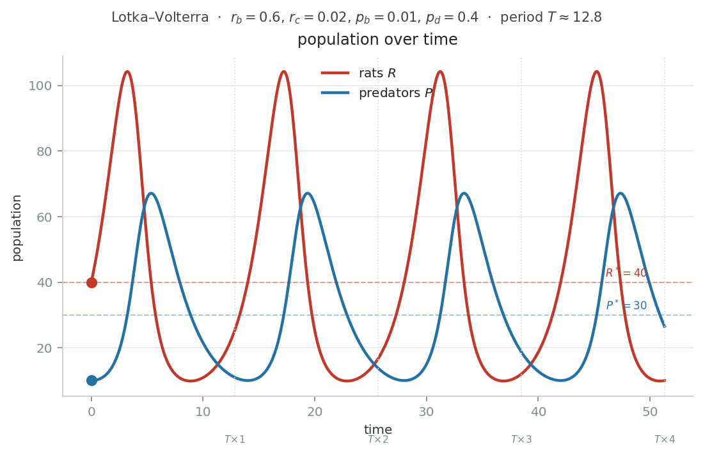
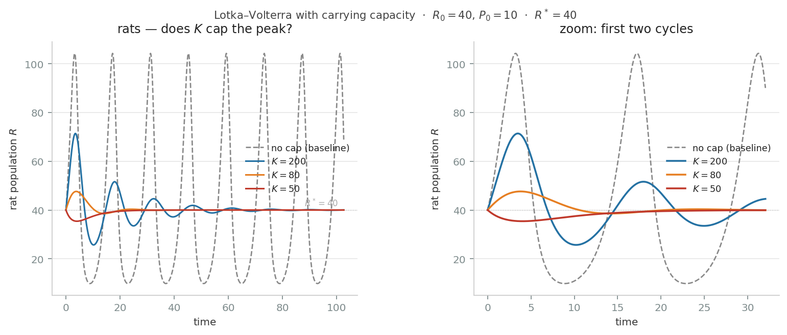

最近台北市老鼠的議題發酵中。民眾反映看到的老鼠變多了。

台北市因應所謂「鼠害」，投放老鼠藥。然而 [台灣猛禽協會指出](https://udn.com/news/story/7323/9478014)，使用老鼠藥並不會讓老鼠減少，反而會變多。

這是因為老鼠藥雖然殺死了老鼠，但也毒害了吃老鼠的老鷹。
老鼠沒辦法用藥一口氣全滅，倖存的個體在極短時間內可以大量繁殖。而老鷹生得少，要長大需要很長時間。

因此過一段時間後，生出來的老鼠沒有老鷹捕食去抑制數量。老鼠將到處橫行。

因為這是一個稍微複雜的動態和因果關係。我感到背後有些數學在運作。

稍加研究之後，我掉到了一個老鼠坑裡，想回答一個問題，卻又釣出了更多的問題。老鼠的數學告訴了我們許多違反直覺的洞見。

頭痛醫頭的做法，看到老鼠就處理老鼠，最後老鼠的業是老鷹在擔。想用老鼠藥把老鼠趕盡殺絕，後果是老鼠反而變越多了。

此外，與老鼠藥相對的政策建議是「不讓鼠來、不讓鼠住、不讓鼠吃」。意圖是從源頭減少老鼠的數量。這會是比較好的做法嗎？數學說，讓老鼠挨餓的效果和你想像的不一樣。

先行揭露，我不是台北居民，我並沒有在當地第一手感受老鼠的影響。

我也沒有任何生態、公衛專業。請不要把這篇當成正經的公共議題討論。

我反而是想挑一個我陌生的議題，看其它領域的數學模型怎麼運作。想探討數學建模的能與不能。在一個正在發生的議題當下，當個數學習題練習。

## Lotka–Volterra 方程式

Lotka–Volterra 是個百年公式了，它捕捉了獵食者與獵物的動態關係。在我們的情境裡，獵物是老鼠，獵食者可以是老鷹。

這方程式其實沒想像中可怕。我們簡單介紹一下可以幫助後面討論。

$$\frac{dR}{dt} = r_b R - r_c R P$$

$$\frac{dP}{dt} = p_b R P - p_d P$$

這兩條方程式是探討老鼠和老鷹隨著時間的變化。讀者可以挑一個喜歡的時間單位，下文會「下期」、「明天」交錯著用，意思都是下一個時間點。

其中 $R$ 是老鼠的數量，$P$ 是其老鷹的數量。
$dR/dt$ 意思是明天老鼠數量的變化，$dP/dt$ 是老鷹數量的變化。

明天老鼠的數量變化，會是新出生的老鼠減去被老鷹吃掉的老鼠。

- 新的老鼠 $r_b R$ ：老鼠的出生率 $r_b$ 乘上現有幾隻老鼠 $R$。
- 老鼠有幾隻會被吃掉 $r_c R P$ ：要看今天上菜幾隻鼠條，以及有幾隻老鷹要服務。我們加個捕食率的參數 $r_c$，調整老鼠被吃掉的數量。捕食率可以詮釋為老鼠在路上逛來逛去，運氣有多差而被吃掉。

再來看明天老鷹數量的變化。老鷹的增長來自於食物是否充足，減少來自於自然死亡。

- 老鷹的增長 $p_b R P$：今天晚餐吃的老鼠，會變成孵老鷹寶寶的養分。食物來源充足的情況會生比較多老鷹。 $p_b$ 可以看作出生率。
- 老鷹的自然死亡 $p_d P$ ，用死亡率 $p_d$ 乘上現有老鷹數量 $P$ 表示。

我們用個實際的例子：

假設今天有 40 隻老鼠（$R = 40$）和 10 隻老鷹（$P = 10$），以及以下參數：

- 老鼠出生率 $r_b = 0.6$
- 捕食率 $r_c = 0.02$（每隻老鷹每隻老鼠的捕食機率）
- 老鷹死亡率 $p_d = 0.4$
- 老鷹增長率 $p_b = 0.01$

代入老鼠的方程式：

$$\frac{dR}{dt} = r_b R - r_c R P = 0.6 \times 40 - 0.02 \times 40 \times 10 = 24 - 8 = +16$$

今天出生了 24 隻新老鼠，被吃掉 8 隻，明天老鼠變成 **56 隻**。

再看老鷹：

$$\frac{dP}{dt} = p_b R P - p_d P = 0.01 \times 40 \times 10 - 0.4 \times 10 = 4 - 4 = 0$$

今天的食物剛好夠補上自然死亡，明天老鷹數量**持平**，仍是 10 隻。

我們請電腦算個 50 天，老鼠與老鷹的消長如圖。

另外， AI 也幫我做了 [互動遊戲](https://chihchengliang.github.io/rat_sim/)，讀者可以來玩玩看是否可以下老鼠藥控制族群數量。

這個模型告訴我們的第一件事是：捕食者與獵物的數量，會呈現**週期性的變化**。

老鷹在食物充足的時候會數量增加，這導致老鼠被大量捕食而數量減少。老鼠的減少造成老鷹的食物變少，老鷹數量也會因此降下來。在老鷹數量降下來時，老鼠的捕食又變少了，因此老鼠的數量又回到一開始的水準。

因此我們在討論老鼠數量的時候，**不應該假設他們是一個常數**。老鼠的數量會波動。

模型告訴我們的第二件事，是這個模型有個老鼠數量與老鷹數量的均衡。雖然老鼠和老鷹的數量一直在波動，幾乎永遠不會停在均衡處。但我們附錄會證明，均衡數量在這模型裡剛好等於一個週期的平均數量。這讓我們可以用均衡來討論政策建議。

在毫無人類干預之下，這個模型的均衡這樣解：

假設鷹鼠雙方的數量，剛好停在一個完全不會動的地方，明天的增減都是零。$dR/dt = 0$，且 $dP/dt = 0$。

這可以解

$$\frac{dR}{dt} = r_b R - r_c R P = 0$$

得 $R = 0$ 或 $P = r_b/r_c$

$$\frac{dP}{dt} = p_b R P - p_d P = 0$$

得 $P = 0$ 或 $R = p_d/p_b$

綜合起來，只有下面這兩個組合是合理的

$$(R^\ast, P^\ast) = (0,\ 0)$$

$$(R^\ast, P^\ast) = \left(\frac{p_d}{p_b},\ \frac{r_b}{r_c}\right)$$

第一個均衡是老鼠老鷹全滅。老鼠一隻都沒有，所以也不會生新的老鼠。老鷹沒老鼠吃，所以也不會生出新的老鷹來。

這個均衡比較特別，也比較不實際。

第二個均衡則是正常狀況。

我的數學經驗學到的是，看到一坨 a b c d 的代數組在一起時，要看這個式子裡有哪些變數，而且更重要的是：**沒有哪些變數**

在第二個均衡裡，**老鼠的均衡數量 $R^\ast$，完全是由老鷹的參數 $p_d/p_b$ 決定的**！裡面沒有任何老鼠的參數。所以讓老鼠生少一點，或容易被捕食之類的完全不會影響老鼠的數量。

老鼠的參數都影響到誰了？影響到了老鷹！

老鼠基本上就是老鷹的存糧。

老鷹生得少、死得快時，老鼠的均衡數量就會增加。

而老鼠生得多、不容易被捕食時，老鷹的存糧消耗比較慢，老鷹的均衡數量增加。

## 政策干預

好，現在我們有了模型來描述老鼠數量的行為之後。我們可以問，有哪些參數是我們「想要」或「能夠」外力干預的？從人類自我中心主義的角度出發，有沒有辦法干預之後對我們都市的居民有些好處？

第一個能干預的是老鼠或老鷹數量的均衡。在Lotka–Volterra 方程式中，均衡數量剛好是一個週期中，都市平均每天暴露在多少隻老鼠之中。所以如果我們關心平均數量，可以用均衡數量來當代表。

有些 [新聞](https://news.ltn.com.tw/news/life/breakingnews/5425818) 會提到，老鼠會咬壞電線，造成火災風險或設備損失。這類的損失就是和老鼠平均數量比較相關的，我們可以控制老鼠數量的均衡。

除了均衡以外，我們還有什麼可以干預呢？像流行病之類的，可能受到平均曝鼠不是那麼重要，而是波峰來臨時會不會觸發鼠疫。所以我們可能想控制老鼠波峰的高度。

然而，這個模型的週期是非線性的，波峰的高度沒解析解。所以沒有直接的參數可以分析。別擔心，後面我們會另闢蹊徑。

最後，週期是我們可以想辦法干預的。模型可以導出一個逼近的週期 $T = \frac{2\pi}{\sqrt{r_b p_d}}$。也許讓老鼠達到高峰的週期長一點可以降低鼠疫爆發的風險。

## 政策一：使用老鼠藥

首先，我們得討論老鼠藥是怎麼使用。

我們又要分種類和干預頻率討論。

種類上

第一種是完美的老鼠藥，只會消滅老鼠，不會害到老鷹。

第二種是比較實際的老鼠藥，他會生物累積。老鼠吃多了，老鷹會容易死。

干預頻率的話，我們可以討論一次性的大灑藥，移除現有的老鼠和老鷹。又或是常態性的灑藥，在每期移除動物。

一次性的大灑藥，移除現有的老鼠或老鷹，在模型的效果是調整初始狀態的位置。也許讀者會想把波動壓平似乎是功德一樁，但基本上想直接去微調狀態是不實際的。

但我們的模型並不是實驗室裡的砝碼和彈簧，也不是示波器上面的訊號。這是一個高度簡化的模型，他並不是用來捕捉真實數據並做量化處理的，而是用其參數的性質做質性的討論。

週期性的灑藥，才有對微分方程內的變數產生變化。

我們看第一種完美的藥

$$\frac{dR}{dt} = r_b R - r_c R P - k R$$

這個藥的效果是每期移除一些老鼠，以滅鼠率 $k$ 乘上當下老鼠數量 $R$ 表達

$$\frac{dR}{dt} = (r_b - k) R - r_c R P$$

但我們整理變數後發現，實際上灑藥在數學上的效果，相當於降低出生率的值。我們只是讓下期增加的老鼠變少。

$$(R^\ast, P^\ast) = \left(\frac{p_d}{p_b},\ \frac{r_b - k}{r_c}\right)$$

均衡打開來看，哇老鼠沒減少，但老鷹減少了。這個數學上的毒藥效果是把老鷹的食物減少。

再來看第二種老鼠藥，我們假設他傷害老鼠和老鷹的效果分別是 $k$ 和 $l$

$$\frac{dR}{dt} = r_b R - r_c R P - k R$$

$$\frac{dP}{dt} = p_b R P - p_d P - l P$$

老鼠效果一樣，老鷹變數一合併，相當於死亡率增加

我們再看均衡

$$(R^\ast, P^\ast) = \left(\frac{p_d + l}{p_b},\ \frac{r_b - k}{r_c}\right)$$

哇，灑了藥之後，老鼠不減反增了！越灑越多。這是怎麼回事？

因為老鷹死得多，少了一些老鷹在吃老鼠。

我們都還不用假設老鷹和老鼠生育時間、數量的差別，就已經得到這樣的結論了。[^2]

維基百科有個頁面叫做殺蟲藥的悖論，就是在講這個結論。 https://en.wikipedia.org/wiki/Paradox_of_the_pesticides

$$\frac{dR}{dt} = r_b R(t) - r_c R(t) P(t)$$

$$\frac{dP}{dt} = p_b R(t-\tau) P(t-\tau) - p_d P(t)$$

## 「不讓鼠來、不讓鼠住、不讓鼠吃」

這句話我們需要拆解一下，到底具體是哪些面向

https://www.cdc.gov.tw/Bulletin/Detail/t7U_mzNHOLqp8jDXZLkyhg?typeid=9
疾管署的網頁顯示

> 民眾平時應留意環境中老鼠可能入侵的路徑，家中廚餘或動物飼料應妥善處理，並隨時做好環境清理，防火巷、排水設施（下水道、水溝蓋）、雜物堆、牆垣為鼠類族群活動熱區，請針對該等特定環境加強捕鼠與滅鼠工作。
另有

> 漢他病毒症候群為人畜共通傳染病，在自然界的傳播宿主為鼠類等齧齒類動物，人類吸入或接觸遭帶有漢他病毒鼠類排泄物或分泌物(包括糞便、尿液、唾液)污染之塵土、物體，或被帶有病毒的齧齒類動物咬傷，就有感染的風險。

疾管署的目的主要是為了避免人們得到漢他病毒。雖然提到捕鼠和滅鼠，但目的是避免老鼠接近住宅。避免民眾接觸鼠類排泄物而感染。這是合理行動。

這目的不是減少都市裡老鼠的總數量。

我們可以討論一下以減少老鼠總量為目的的捕鼠或滅鼠。不管是用藥或用陷阱，目的都是移除下一期的老鼠。這在數學上的呈現是一樣的，最後就是老鷹去承受這些後果。

## 環境負載

有趣的是「不讓鼠吃」這個點。疾管署的建議看起來是避免老鼠進入民宅或人類活動空間，造成感染。但也有許多新聞強調，都市中處理不善的食物和垃圾，讓老鼠有很多食物可以吃，得以增長族群。

讓老鼠找不到食物，可以減少老鼠總量嗎？

目前我們的模型假設老鼠有無限充足的食物，沒有獵食者的情況下，想生多少就生多少。

這讓我們的模型陷入雞肉模型的問題。我們已經在假設中下了結論了，這樣不好。

幸好我們的模型就像一碗原味豆花一樣，可以想加什麼料就加。

我們可以加上一個馬爾薩斯天花板 K，假設都市裡有個老鼠的環境負載力上限。老鼠數量快碰到天花板，鼠口就會成長緩慢。穿越天花板時，鼠口會負成長。

這樣我們可以討論假設垃圾和廚餘控制住了，壓低天花板，對鼠口有什麼影響。

更新的公式如下，老鼠的出生受到 $(1-R/K)$ 項的抑制。

$$\frac{dR}{dt} = r_b R \left(1 - \frac{R}{K}\right) - r_c R P$$

$$\frac{dP}{dt} = p_b R P - p_d P$$

照前面重複的步驟

獵食者那條仍然可以算出 $P = 0$ 或 $R^\ast = p_d/p_b$

$$\frac{dR}{dt} = r_b R \left(1 - \frac{R}{K}\right) - r_c R P = 0$$

得 $R = 0$ 或

$$P^\ast = \frac{r_b}{r_c}\left(1 - \frac{R^\ast}{K}\right) = \frac{r_b}{r_c}\left(1 - \frac{p_d/p_b}{K}\right)$$

哇，老鼠的均衡數量沒受到影響耶！環境負載力的後果還是老鷹在承受。

而且這裡還有個**恐怖生態後果**。如果我們要均衡老鷹數量是正的，也就是 $P^\ast > 0$，這要求 $(1 - R^\ast/K)$ 要是正的。也就是老鼠總量不能超越環境負載力，又或是環境負載力不能對老鼠數量有約束力。

如果太激進的廚餘與垃圾政策壓迫到了老鼠數量，最後均衡會變成 $(P, R) = (0,\ K)$，老鷹都餓死了，老鼠長到負載力天花板。

但負載力天花板的確有好處的！如下圖所示，負載力天花板產生了一個好像阻尼力的效果。在長期可以把老鼠的波動壓平。

負載力天花板的甜蜜點應該要剛好在老鼠均衡數量的上方一點點 $K > R^\ast$。這樣可以壓制老鼠波動的高峰，又不影響老鷹的生存。

注意阻尼需要過幾個週期才會發酵。如果現在鼠災當下執行政策，並不會馬上看到效果。

## 政策目標

我們其實要問，我們消滅老鼠的目標是什麼？

是人們目擊老鼠心生畏懼，心中產生負效用？

巴黎有一批動物權利倡導者，提出了「挺鼠」的論點，認為城市空間不應只屬於人類。

主要聲音來自巴黎市議員 Douchka Marcovitch（動物黨籍），以及壓力團體「巴黎動物星球」（Paris Animaux Zoopolis，PAZ）。他們的論點圍繞幾個主題：

**廢棄物處理論點**：支持者主張，老鼠每天在巴黎吃掉約 100 噸廢棄物，防止城市下水道堵塞。老鼠是一種免費的廢棄物管理服務，城市卻想把它消滅。（France 24）

**藥毒無效論點**：比起傳統老鼠藥，有更溫和的方法存在——藥毒不僅殘忍，最終也缺乏效率，因為囓齒類動物會對其毒性產生免疫，甚至學會避開誘餌。這與我們的模型結論不謀而合——巴黎約有 40% 的老鼠已對抗凝血劑產生抗藥性。（France 24）

**典範轉移論點**：Marcovitch 主張，老鼠是廢棄物處理的輔助者，表示「我們必須改變典範」，追問「老鼠的生活方式」，以找到有效且符合倫理的對策。（City Journal）

**權利論點（較激進）**：PAZ 主張，都市空間不應獨屬人類，必須終結這種人類中心主義的觀念，質問「我們憑什麼剝奪某些動物見到日光的一切機會？」（City Journal）

目前我聽到幾個合理的理由：
- 老鼠帶來疾病：我們下面討論疾病的部分。
- 老鼠會咬壞電線，造成設備的財務損失。

咬壞電線，以老鼠均衡作為控制目標似乎合適。因為其代表平均曝鼠數量。

假設目標是避免疾病。除了把老鼠趕離人們居住處，和模型相關的點是控制峰值。
結論

我們其實透過模型看到許多違反直覺的事。

| 政策 | 直覺預期 | 模型預測 | 原因 |
|------|----------|----------|------|
| 完美殺鼠藥（只殺鼠） | 老鼠數量減少 | 老鼠均衡**不變**，老鷹均衡減少 | 等效於降低老鼠出生率，只是讓老鷹的食物變少 |
| 有生物累積毒性的殺鼠藥 | 老鼠數量減少 | 老鼠均衡**增加** | 老鷹死亡率上升，天敵數量下降 |
| 壓低環境負載力（清廚餘垃圾） | 老鼠數量減少 | 老鼠均衡不變，老鷹均衡減少；若壓太低則老鷹滅絕 | 老鼠均衡由獵食者參數決定，與老鼠本身的條件無關 |
| 改善老鷹棲地（降低老鷹死亡率） | — | 老鼠均衡**減少** | 均衡老鼠數量 $R^\ast = p_d/p_b$，直接受獵食者死亡率影響 |

老鼠問題看起來不是一件頭痛醫頭的事。反而是要頭痛醫腳，腳痛醫頭。

要處理老鼠的事，先照顧好老鷹。

## 附錄

### 老鼠討論

有學者建議，我們討論老鼠問題不應該只講老鼠，應該區分：溝鼠、小黃腹鼠、亞洲家鼠、玄鼠等等。每種鼠有不同的棲地習性。

但在模型的場景中，我們其實需要的是一隻抽象的代表性老鼠就夠。除非上述老鼠在數學上是不一樣的老鼠，我們不需要分開討論。

獵食者也是，我們只講一隻抽象的老鷹。但讀者腦袋可以自行代換喜歡的動物：鳳頭蒼鷹、黑鳶、貓頭鷹、或 Python 。會吃老鼠即可。

### 平均數量

我們這邊證明均衡數量是平均數量

我們用獵食者方程式

$$\frac{dP}{dt} = p_b R P - p_d P$$

兩邊同除 $P$：

$$\frac{1}{P}\frac{dP}{dt} = p_b R - p_d$$

左側就是 $d(\ln P)/dt$，代表 $P$ 的百分比變化率。對一個完整週期 $T$ 積分：

$$[\ln P]_0^T = p_b \int R \, dt - p_d T$$

由於 $P$ 是週期函數，$\ln P(T) = \ln P(0)$，左側為零：

$$0 = p_b \int R \, dt - p_d T$$

$$\frac{1}{T}\int R \, dt = \frac{p_d}{p_b}$$

因此：

$$\langle R \rangle = \frac{p_d}{p_b} = R^\ast$$

老鼠的時間平均值等於均衡值。對老鼠方程式施以相同步驟，可得 $\langle P \rangle = P^\ast$。

均衡數量等於一個週期的平均數量這點其實是 Lotka–Volterra 碰巧的性質。模型加料就會壞掉。均衡的性質再加入更多現實假設（如附載力上限、年齡結構、隨機性）後可能不再成立。

### 週期

系統：

$$\frac{dR}{dt} = r_b R - r_c R P, \qquad \frac{dP}{dt} = p_b R P - p_d P$$

───

**1. 均衡**

令兩式的導數為零：

老鼠方程式：$r_b R - r_c R P = 0 \implies R(r_b - r_c P) = 0$

因此 $R = 0$ 或 $P = r_b/r_c$

獵食者方程式：$p_b R P - p_d P = 0 \implies P(p_b R - p_d) = 0$

因此 $P = 0$ 或 $R = p_d/p_b$

由此得到兩個均衡點：
- $(R^\ast, P^\ast) = (0,\ 0)$ — 平庸解，全部滅絕
- $(R^\ast, P^\ast) = (p_d/p_b,\ r_b/r_c)$ — 共存均衡

───

**2. 穩定性——線性化**

為了瞭解共存均衡附近的行為，進行線性化。令：

$$R = R^\ast + r, \quad P = P^\ast + p$$

其中 $r, p$ 是微小的擾動。代入方程式後，捨去二階項（$rp \approx 0$）：

老鼠方程式展開後，利用均衡條件 $r_b R^\ast = r_c R^\ast P^\ast$ 抵消，且 $r_c P^\ast = r_b$：

$$\frac{dr}{dt} = -r_c R^\ast \cdot p$$

獵食者方程式展開後，利用均衡條件 $p_b R^\ast P^\ast = p_d P^\ast$ 抵消，且 $p_b R^\ast = p_d$：

$$\frac{dp}{dt} = p_b P^\ast \cdot r$$

───

**3. 線性化系統**

$$\begin{pmatrix} \dot{r} \\ \dot{p} \end{pmatrix} = \begin{pmatrix} 0 & -r_c R^\ast \\ p_b P^\ast & 0 \end{pmatrix} \begin{pmatrix} r \\ p \end{pmatrix}$$

───

**4. 特徵值**

$$\det(A - \lambda I) = 0 \implies \lambda^2 + r_c p_b R^\ast P^\ast = 0 \implies \lambda = \pm i\sqrt{r_c p_b R^\ast P^\ast}$$

純虛數特徵值——確認均衡是一個「中心」，系統繞其環繞，既不螺旋收斂也不螺旋發散。中性穩定。

───

**5. 震盪週期**

$\lambda$ 的虛部即為角頻率。代入 $R^\ast = p_d/p_b$ 與 $P^\ast = r_b/r_c$：

$$\omega = \sqrt{r_c p_b \cdot \frac{p_d}{p_b} \cdot \frac{r_b}{r_c}} = \sqrt{r_b p_d}$$

週期為：

$$T = \frac{2\pi}{\omega} = \frac{2\pi}{\sqrt{r_b p_d}}$$

───

**6. 守恆量**

將兩方程式相除後分離變數：

$$\frac{r_b - r_c P}{P}\, dP = \frac{p_b R - p_d}{R}\, dR$$

兩側積分整理後得守恆量：

$$V(R,P) = p_b R - p_d \ln R + r_c P - r_b \ln P = \text{常數}$$

每條軌跡都是 $V$ 的等位曲線。

───

**7. 為何 V 在均衡點有極小值**

對 $V$ 求偏導令其為零：

$$\frac{\partial V}{\partial R} = p_b - \frac{p_d}{R} = 0 \implies R = \frac{p_d}{p_b} = R^\ast$$

$$\frac{\partial V}{\partial P} = r_c - \frac{r_b}{P} = 0 \implies P = \frac{r_b}{r_c} = P^\ast$$

在 $(R^\ast, P^\ast)$ 的 Hessian：$\partial^2 V/\partial R^2 = p_d/{R^\ast}^2 > 0$，$\partial^2 V/\partial P^2 = r_b/{P^\ast}^2 > 0$，交叉項為零。正定——因此 $(R^\ast, P^\ast)$ 是 $V$ 的嚴格極小值，等位曲線即為封閉軌道。

───

**結果摘要**

| 結果 | 表達式 | 取決於 |
|------|--------|--------|
| 老鼠均衡 | $R^\ast = p_d/p_b$ | 僅獵食者參數 |
| 獵食者均衡 | $P^\ast = r_b/r_c$ | 僅老鼠參數 |
| 角頻率 | $\omega = \sqrt{r_b p_d}$ | 各一個參數 |
| 週期 | $T = 2\pi/\sqrt{r_b p_d}$ | 各一個參數 |
| 守恆量 | $V = p_b R - p_d \ln R + r_c P - r_b \ln P$ | 全部參數 |

週期 $T = 2\pi/\sqrt{r_b p_d}$ 特別優雅——它是老鼠出生率與獵食者死亡率的幾何平均，這兩個參數分別從相反方向驅動週期循環的「回復力」。

### 疾病

疾病的基本再生數 $R_0$ 為：

$$R_0 = \frac{\lambda S}{\nu} \cdot R$$

$R_0 > 1$ 表示疫情將擴散。關鍵在於，$R_0$ 與老鼠族群數量 $R$ 呈線性比例。

一個在 20 到 80 之間震盪（均值 50）的老鼠族群，比穩定維持在 50 隻的族群更危險。原因在於：當數量衝到 80，可能使 $R_0$ 超過 1，引發疫情爆發——即使平均值看起來無害。傳染病不在乎平均數，在乎的是有沒有越過臨界值。

因此在避免疾病這塊，我們可能不在乎平均曝鼠時間，而是希望峰值不要太高。

但峰值在方程式裡沒有解析解，所以也不太好討論。另一種可能是用環境負載力去壓。

[^2]: 加入時間延遲的 delay differential equation 可以描述老鷹繁殖滯後的效果，但沒有解析解。長相大概像這樣 $\frac{dR}{dt} = r_b R(t) - r_c R(t)P(t)$，$\frac{dP}{dt} = p_b R(t-\tau)P(t-\tau) - p_d P(t)$
